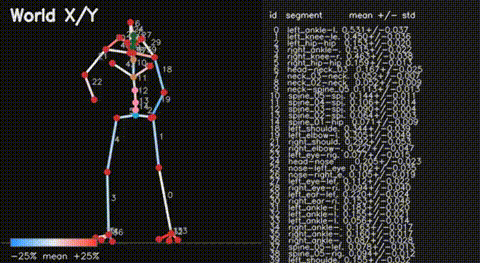
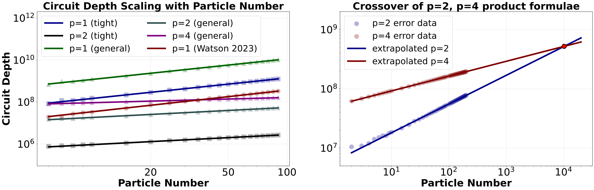
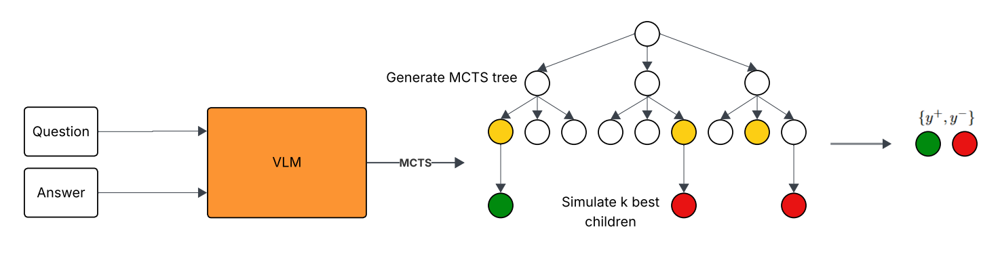
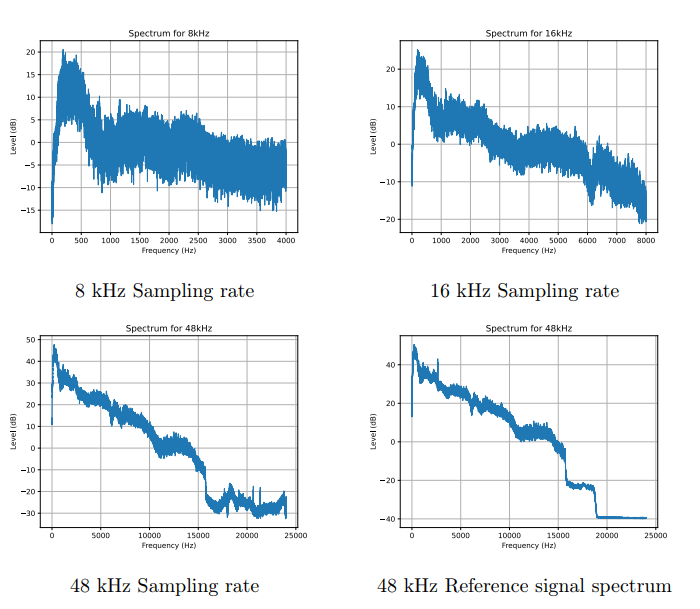

## About Me

Currently, I am interested in the theory and design of AI Agents and Deep Learning Models. Although current AI agents are very powerful and deployable in a large variety of applications, I strongly believe AI agents have not reached their full potential. More specifically, I believe that current limitations of AI models are rooted in model design rather than compute power. My most recent projects spanned a range of AI and Machine Learning applications, being Keypoint Reconstruction for Sports Analytics, Guardrails for safe LLM Agents, and Bandit Search for AI Agents. On top of interests in AI, I am also interested in the development of theory of Quantum Algorithms. In the near future, we will have Quantum Computers, and understanding the theoretical capabilities and applications will be crucial to use these technologies effectively. In quantum computing, I specialize in quantum simulation. Aside from school, I really enjoying teaching and playing chess, basketball and ice hockey.

## Education

**M.S. in computer science** Aug 2024 - May 2026 \\
University of Maryland, College Park

**B.S. in computer science** Spring 2021 - May 2024 \\
University of Maryland, College Park 

## Projects

<ol class="bibliography">

<li>

<abbr>In Progress</abbr>

<table>                                                                                                                                                                                                                                                                
    <tr>
      <td></td>
      <td></td>
    </tr>
</table>
<!--  -->

Keypoint Reconstruction for Sports Analytics

(In Progress): An AI assistant tool to help point out Hockey player weaknesses from game film.

</li>

<li>

<abbr>Preprint</abbr>

Computing error bounds for product-formula simulations of translation-invariant Hamiltonians

A python package for efficiently computing error bounds of product-formula simulations on quantum computers. Will share upon request.

<a class="btn">PDF (Coming Soon!)</a>
<a class="btn" href="https://github.com/JamesDWatson/Product-Formula-Bounds">Code (Coming Soon!)</a>

</li>

<li>

<abbr>Preprint</abbr>

<a href="https://jandrewzheng.github.io/assets/files/qrgvjdfqpwxmap.pdf">Efficient Bandit Search of Correct Reasoning Paths</a>

Describes a methodology to continuously self-improve LLM performance by picking the best reasoning traces

<a class="btn" href="https://jandrewzheng.github.io/assets/files/qrgvjdfqpwxmap.pdf">PDF</a>
<a class="btn" href="https://github.com/ishantamrakar/ThinkLite-VL">Code</a>

</li>

<li>

<abbr>Preprint</abbr>

<a href="https://github.com/Brandonio-c/ClearComm-NN">ClearCOMM</a>

A Deep Neural Network capable of real-time noise cancellation on edge devices, useful for noisy environments.

<a class="btn" href="https://arxiv.org/pdf/2405.20884">PDF</a>
<a class="btn" href="https://github.com/Brandonio-c/ClearComm-NN">Code</a>

</li>

</ol>

## Work Experiences

I am fortunate to have many opportunities to contribute to meaningful work. Here are my most recent work experiences.

**REU Intern at UMD**

I had the chance through an REU program to work full-time on quantum simulation research I started in the Spring of 2024 during the summer of 2024 as part of UMD's REU CAAR program. I enjoyed collaborating with other REU students working on research. Over the summer, I focused on extending my simulation of k-local Hamiltonians to include fermionic operators, building on the previous work with Pauli operators. This experience gave me the chance to work on a project full-time, free from the usual pressures of coursework. It gave me a clear insight into life as a graduate student. 

**ITS Intern at AARP**

As an intern, I deployed AI agents for help-desk queries. To accomplish this, I built web-scrapers to scrape important information from company websites. Then, I fine-tuned a publicly available pretrained question-answer model from the internet. This model was hosted completely locally. I appreciated that I was trusted with the opportunity to do something impactful for the company despite only being an intern.

**Teaching Assistant (Discrete Mathematics)**

As a TA, I led my own discussion section, graded student work, and held office hours. What I valued most was the freedom to teach in my own way. I enjoyed sharing how I personally understood the material and being able to interact with students directly. Having my own section meant I could tailor explanations to what students were struggling with, which I could gauge from grading and office hours. I found it rewarding to bring my own ideas and intuitions into the classroom and see students engage with the material on a deeper level. I really enjoyed my TA experience and I wish to do more in the form to teaching later on.

**Kumon Math and Reading Center of Clarksville**

At this job, I taught a lot of students of differing ages, from toddlers to students in high school. I predominantly taught high-level math, which included topics from Algebra II, Precalculus, Calculus I and Calculus II. I really enjoyed this job because it allowed me to work with a group of students over a long period of time and watch each of them grow.

## Teaching

- Teaching Assistant, <a href="https://www.cs.umd.edu/class/fall2024/cmsc250-010X/">Discrete Structures</a> for <a href="https://pauliankline.com/cv/">Professor Paul Kline</a>, Spring 2023
- Math Tutor at <a href="https://www.kumon.com/CLARKSVILLE">Kumon, Clarksville</a>

## Hobbies

Chess is one of my lifetime hobbies. I picked up chess when I was 5 years old, and I fell in love with it ever since. I took chess seriously as a kid, achieving National Master Title (NM) at 12 years old. As a high schooler, I taught public chess lessons at local community college. More recently, I represented my University Chess Team in Pan American Chess Championships in 2021 and 2022. Nowadays, I play the game online recreationally. You can find me on chess.com here: <a href="https://www.chess.com/member/bravehorse">bravehorse</a>

Ice Hockey is another lifetime hobby. I played on competitive ice hockey teams until I attended college. My last year of competitive ice hockey, I played on the Washington Little Caps AAA U18 (2020) team. I served my community by volunteering for the <a href="https://montgomerycollege.galaxydigital.com/agency/detail/?agency_id=170280">Capital Dragons</a> Ice Hockey teams and skating with disabled hockey players on my high school team. Currently, I don't play on any hockey teams, but I hope to join a beer league hockey team in the near future. I enjoy pond skating during cold winters for the fresh scenery and free ice. Nowadays, I enjoy playing pickup basketball, where I am a rec center role player. 